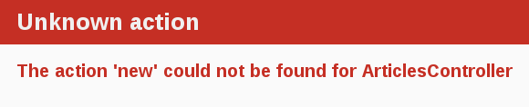
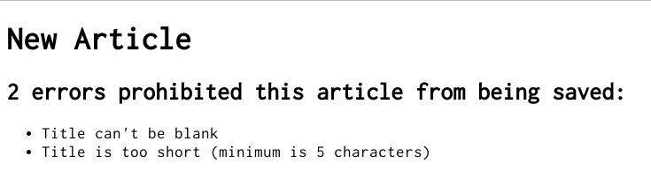
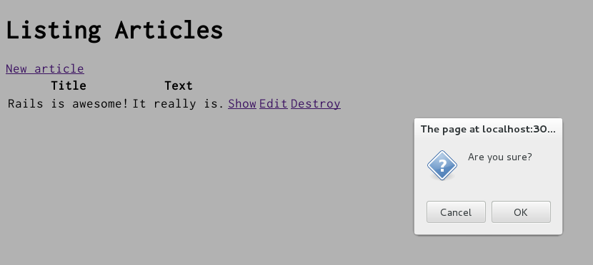

Bắt đầu với Laravel
==========================

Hướng dẫn này bao gồm làm quen và tạo web app bằng Laravel PHP.

Sau khi đọc hướng dẫn này, bạn sẽ biết:

* Cách cài Laravel, tạo app Laravel, và kết nối vào một database.
* Bố cục của app Laravel.
* Các nguyên lý cơ bản trong MVC (Model, View, Controller) và thiết kế RESTful.
* Cách tạo ra các phần của một app Laravel.

--------------------------------------------------------------------------------

Chuẩn bị
-----------------

Hướng dẫn này được thiết kế cho người mới bắt đầu muốn làm app Laravel từ đầu.
 Bạn không cần bất kỳ kiến thức Laravel nào trước đây.

Laravel là framework cho web app chạy trên ngôn ngữ PHP.
Nếu bạn chưa từng thử PHP, bạn sẽ thấy Laravel hơi khó.
Dưới đây là danh sách các tài liệu online để học PHP: (được sắp xếp theo thứ tự)

* [Trang web Chính thức PHP](https://php.net/en/documentation/)
* [List các Sách lập trình Free](https://github.com/vhf/free-programming-books/blob/master/free-programming-books.md#php)

Lưu ý rằng một số tài liệu của các phiên bản của PHP cũ như
5.3, sẽ không bao gồm một số cú pháp mà bạn sẽ thấy khi phát triển app Laravel hàng ngày.

Laravel là gì?
--------------

Laravel là một framework phát triển web application viết bằng ngôn ngữ PHP.
Được thiết kế để làm cho lập trình các web applications dễ dàng hơn bằng cách tạo sẵn những gì mọi developer cần để bắt đầu. Nó cho phép bạn viết ít code 
 hơn trong khi xong nhiều tính năng, nhanh hơn nhiều ngôn ngữ khác và các frameworks khác.
Các developers Laravel có kinh nghiệm cũng nói rằng Laravel khiến cho web application
development vui hơn.

Laravel là software "độc đoán". Nghĩa là nó quyết định rằng có một cách "tốt nhất"
để làm mọi việc, và nó được thiết kế để khuyến khích cách đó - và trong một số trường hợp ngăn không cho dùng các lựa chọn thay thế. Nếu bạn học "The Laravel Way" có lẽ bạn sẽ khám phá ra một
Tăng năng suất. Nếu bạn cố đưa những thói quen cũ từ các ngôn ngữ khác để phát triển Laravel, và cố gắng sử dụng các patterns bạn học được ở nơi khác, bạn có thể sẽ có một trải nghiệm tồi tệ.

Triết lý Laravel bao gồm hai nguyên tắc chính:

* **Don't Repeat Yourself:** DRY là một nguyên tắc phát triển phần mềm mà
  tuyên bố rằng "Trong một hệ thống, mọi đoạn thông tin (mọi mẩu code) đều phải là duy nhất, rõ nghĩa, hữu dụng. "Bằng cách không viết cùng một thông tin hơn và hơn một lần, code của chúng ta sẽ dễ maintain hơn, dễ mở rộng hơn, và ít lỗi.
* **Convention Over Configuration:** Laravel có quan điểm ​​về cách tốt nhất để làm nhiều thứ trong một web application, và mặc định là bộ quy tắc này, hơn là yêu cầu bạn chỉ định chi tiết thông qua các file config vô tận.

Tạo mới Laravel Project
----------------------------
Cách tốt nhất để đọc hướng dẫn này là làm theo từng bước một. Tất cả các bước đều cần thiết để chạy app này và không cần thêm code hay bước nào khác.

Bằng cách làm theo song song với hướng dẫn này, bạn sẽ tạo một project Laravel được gọi `Blog`, một weblog (rất) đơn giản. Trước khi bạn bắt đầu xây dựng app,
Bạn cần đảm bảo rằng bạn đã cài Laravel.

TIP: Các ví dụ dưới đây dùng `$` đại diện cho terminal prompt(dấu nhắc lệnh trong command-line của bạn) trong hệ điều hành UNIX-like, dù nó có thể được tùy chỉnh để hiển thị theo cách khác. Nếu bạn đang dùng Windows,
Dấu nhắc của bạn sẽ là `C:\path\to\htdocs>`

### Cài Laravel

Trước khi cài Laravel, bạn nên kiểm tra để chắc chắn rằng hệ thống của bạn đáp ứng prerequisites. Chúng bao gồm PHP và MySQL.

Mở command line. Trên macOS mở Terminal.app, trên Windows chọn
"Run" từ menu Start và gõ 'cmd.exe'. Bất kỳ lệnh bắt đầu với một ký hiệu đô la `$` sẽ được chạy trong command line. Verify rằng bạn đã cài version hiện tại của PHP:

```bash
$ ruby -v
ruby 2.3.1p112
```

Laravel yêu cầu phiên bản PHP 5.6.4 trở lên. Nếu version number trả về là
nhỏ hơn 5.6.4, bạn sẽ phải cài một bản sao của PHP.

TIP: Có sẵn công cụ giúp bạn cài đặt PHP và PHP Laravel. Người dùng Windows có thể cài [Bitnami WAMP](https://bitnami.com/stack/wamp),
Trong khi người dùng macOS có thể sử dụng [XAMPP](https://www.apachefriends.org/download.html).
Để biết thêm cách cài cho hầu hết các Hệ điều hành hãy xem
[Ruby-lang.org](https://www.apachefriends.org/index.html).

Bạn cũng cần cài đặt cơ sở dữ liệu SQLite3.
Các hệ điều hành UNIX-like phổ biến đi kèm với một phiên bản chấp nhận được của SQLite3.
Trên Windows, nếu bạn đã cài đặt Laravel qua Bitnami WAMP, thì bạn cũng đã cài SQLite. Những người khác có thể tìm hướng dẫn cài đặt tại trang web [MySQL Server](https://dev.mysql.com/downloads/installer/).
Verify rằng nó được cài và trong PATH của bạn:

```bash
$ sqlite3 --version
```

SQLite sẽ trả về phiên bản của nó.

Để cài Laravel, sử dụng lệnh `composer global require "laravel/installer"` được cung cấp bởi [GetComposer](https://getcomposer.org/download/):

```bash
$ composer global require "laravel/installer"
```

Để verify rằng bạn đã cài đặt đúng mọi thứ, bạn sẽ có thể
Chạy như sau:

```bash
$ laravel - v
```

Nếu có nội dung như "Laravel Installer 1.3.7", bạn đã sẵn sàng tiếp tục.

### Tạo app Blog

Laravel đi kèm với một số scripts được gọi là generators mà được thiết kế để giúp bạn phát triển app dễ dàng hơn bằng cách tạo ra mọi thứ cần thiết để bắt đầu code trên một task nhất định. Một trong số đó là new application generator, sẽ cung cấp cho bạn app Laravel mới nên bạn không phải tự viết

Để dùng generator này, hãy mở command-line, mở một thư mục, và gõ:

```bash
$ laravel new blog
```

Lệnh này sẽ tạo một app Laravel tên là Blog trong thư mục `blog` và cài các thư viện dependencies đã được liệt kê trong `composer.json` bằng cách sử dụng
`composer update`.


TIP: Bạn có thể thấy tất cả các options  lệnh mà app Laravel builder chấp nhận bằng cách chạy `laravel new -h`.

Sau khi bạn tạo app blog, chuyển sang thư mục đó:

```bash
$ cd blog
```

Thư mục `blog` có một số files và folders được tạo ra tự động
làm ra của một app Laravel. Hầu hết công việc trong hướng dẫn này sẽ nằm trong thư mục `app`, nhưng đây là tóm tắt cơ bản về chức năng của từng
files và folders mà Laravel tạo theo mặc định:

| File/Folder | Purpose |
| ----------- | ------- |
|app/| Bao gồm controllers, models, helpers, mailers, channels, jobs và assets cho app của bạn. Bạn sẽ tập trung vào thư mục này cho phần còn lại của hướng dẫn này.|
|resources/| Bao gồm các views, assets chưa được compiled|
|artisan| Chứa bộ lệnh mà bắt đầu app của bạn và có thể chứa các bộ lệnh khác mà bạn sử dụng để setup, update, deploy hoặc run app của bạn.|
|config/| Config database và nhiều thứ khác. Sẽ được trình bày chi tiết hơn trong [Cấu hình app Laravel](configuring.html).|
|.env| Cấu hình environment cho DotEnv dựa trên máy chủ được dùng để start app.
|database/| Chứa cấu trúc database hiện tại, cũng như các database migrations.|
|composer.json <br>composer.lock| Các tệp này cho phép bạn chỉ định những thư viện phụ thuộc (dependencies libraries) cần thiết cho app Laravel của bạn. Những files này được sử dụng bởi Composer autoload. Để biết thêm thông tin về Composer, xem [GetComposer](http://getcomposer.org).|
|vendor/| Mô-đun mở rộng (dependencies libraries) cho app của bạn |
|public/|Là thư mục có thể xem công khai trên Internet. Chứa các static files và các assets đã dịch.|
|README.md| Đây là hướng dẫn sử dụng ngắn gọn cho app của bạn. Bạn nên chỉnh sửa tệp này để người khác biết app của bạn dùng làm gì, Cách setup, v.v.|
|tests/|Unit tests, fixtures, và các loại test khác. Được đề cập trong [Testing Laravel Applications](testing.html).|
|storage/|Các tệp được tạo trong quá trình app làm việc.|
|.gitignore|Tệp này cho biết tệp (hoặc patterns) nào cần bỏ qua. Xem [GitHub - Ignoring files](https://help.github.com/articles/ignoring-files) để biết thêm thông tin về việc bỏ qua files.

Xin chào, Laravel!
-------------

Để bắt đầu, hãy hiển thị text trên màn hình một cách nhanh. Để làm điều này, bạn cần phải bắt đầu chạy Laravel application.

### Khởi động Web Server

Bạn thực sự đã có app Laravel. Để xem nó, bạn cần phải start web server trên máy tính của bạn. Bạn có thể làm điều này bằng cách chạy lệnh sau trong thư mục `blog`:

```bash
$ php artisan serve
```


Điều này sẽ kích hoạt Artisan Server, một máy chủ web mặc định đi kèm với Laravel. Để xem
app của bạn đang hoạt động, mở Chrome và mở
<http://localhost:8000>. Bạn sẽ thấy page thông tin mặc định Laravel:


TIP: Để dừng máy chủ web, hãy nhấn Ctrl +C trong cửa sổ command-line nơi Server
đang chạy. Để verify máy chủ đã dừng, bạn sẽ lại thấy con trỏ nhắc lệnh. Đối với hầu hết các hệ thống UNIX-like như macOS, đó sẽ ký hiệu đô la `$`. Trong development mode, Laravel thường không đòi hỏi bạn phải khởi động lại máy chủ; Những thay đổi bạn thực hiện trong các files sẽ tự động được load lại từ server.

Trang "Welcome aboard" là _smoke test_ cho một app Laravel mới: Nó chắc chắn rằng bạn đã configured phần mềm đúng và đủ để serve một page.

### Nói "Hello", Laravel

Để Laravel nói "Xin chào", bạn cần tạo tối thiểu một _controller_ và một
_view_.

Mục đích của controller là nhận các requests cho app.
_Routing_ quyết định controller nào nhận được requests nào. Thường, có hơn một route cho mỗi controller, và các route khác nhau được xử lý bởi _actions_ khác nhau. Mục đích từng mỗi action là lấy dữ liệu để chuyển tới view.

Mục đích của view là để hiển thị dữ liệu này dưới dạng con người có thể đọc được (trang web). Cần phân biệt rõ ràng rằng _controller_, không phải view,
là nơi lấy dữ liệu. View chỉ nên hiển thị thông tin đó.
Mặc định, các views viết bằng ngôn ngữ gọi là Blade được xử lý theo request cycle ở Laravel trước khi được gửi đến
user.

Để tạo ra một controller mới, bạn sẽ cần phải chạy "controller" generator và nói với nó rằng bạn muốn một controller "Welcome" với một action "index", chỉ cần:

```bash
$ php artisan make:controller GreetingController --resource
```

Lệnh này sẽ tạo một Controller ở app/Http/Controllers/GreetingController.php, Controller sẽ gồm action index


Hãy mở editor và sửa action 'index':

```php
function index(){
    return view('greeting');
}
```


Tạo file `resources/views/greeting.blade.php` trong editor. 

```html
<h1> Xin chào, Laravel!</h1>
```

### Setting App Home Page

Bây giờ chúng ta đã tạo controller và view, chúng ta cần nói với Laravel khi  nào thì chúng ta muốn "Xin chào, Laravel!" hiển thị. Trong trường hợp của chúng ta, chúng ta muốn nó xuất hiện khi mở link trang chủ, <http://localhost:8000>. Hiện tại,
"Welcome aboard" đang chiếm chỗ đó.

Tiếp theo, bạn phải nói với Laravel nơi đặt trang chủ thực tế của bạn.

Mở file `routes/web.php` trong editor và thay thế phần nội dung PHP bằng code sau.

```php
Route::get('/','GreetingController@index');
```

Đây là _file routing_ trong app của bạn chứa các mục trong một file đặc biệt
[DSL (chưa có bản dịch sát nghĩa trong tiếng Việt)](http://en.wikipedia.org/wiki/Domain-specific_language)
Nói với Laravel cách kết nối các requests  tới với controllers và actions.


`Route::get('/','GreetingController@index');` nói với Laravel hãy trỏ các requests đến <http://localhost:8000/> tới action index của controller GreetingController. Mà controller này đã được tạo ra trước đó khi bạn chạy
controller generator (`php artisan make:controller GreetingController --resource`).

Launch lại web server nếu bạn đã tắt nó để tạo controller (`php artisan serve`) và vào lại link <http://localhost:8000> trong trình duyệt của bạn. Bạn sẽ thấy
"Xin chào, Laravel!" bạn đã code vào `resources/views/greeting.blade.php`,
chứng tỏ route mới này thực sự chạy action `index` trong controller `WelcomeController` và đang hiển thị đúng view.

TIP: Để biết thêm thông tin về routing, hãy tham khảo [Laravel Routing](routing.html).

Chuẩn bị và chạy
----------------------

Bây giờ bạn đã hiểu cách tạo controller, action và view, hãy tạo ra một cái gì đó hữu dụng.

Trong app Blog, bây giờ bạn sẽ tạo một _resource_ mới. Resource là thuật ngữ được sử dụng cho một bộ các objects tương tự, chẳng hạn như articles, people hoặc animals.
Bạn có thể tạo, đọc, sửa, xóa các items cho một resource và các hành động này được gọi là _CRUD_.

Laravel cung cấp một method `resources` có thể được sử dụng để khai báo một
resource chuẩn REST. Bạn cần phải thêm _resource_ vào
`routes/web.php` và file này trông sẽ như sau:

```php
Route::get('/','GreetingController@index');
Route::resource('articles','ArticlesController');
```

Nếu bạn chạy `php artisan route:list`', bạn sẽ thấy rằng đã định nghĩa các routes cho các actions chuẩn RESTful.


Verb      | URI                  | Action       | Route Name
----------|-----------------------|--------------|---------------------
GET       | `/photos`              | index        | photos.index
GET       | `/photos/create`       | create       | photos.create
POST      | `/photos`              | store        | photos.store
GET       | `/photos/{photo}`      | show         | photos.show
GET       | `/photos/{photo}/edit` | edit         | photos.edit
PUT/PATCH | `/photos/{photo}`      | update       | photos.update
DELETE    | `/photos/{photo}`      | destroy      | photos.destroy

Trong phần tiếp theo, bạn sẽ có khả năng tạo các bài viết mới trong
app và có thể hiển thị bài viết. Đây là "C" và "R" trong CRUD:
Create và Read. Và form để làm việc này sẽ giống như sau:


Giờ trông form hơi đơn giản nhưng chẳng sao. Chúng ta sẽ xem xét cải thiện style cho nó sau.

### Laying down the groundwork

Đầu tiên, bạn cần một nơi trong app để tạo ra một bài viết mới.
Tốt nhất là `/articles/create`. Với routes đã được xác định, bây giờ có thể truy cập `/articles/create`.
Mở link <http://localhost:8000/articles/create> và bạn sẽ thấy một lỗi Routing:


Lỗi này xảy ra vì route cần xác định controller để xử lý request. Giải pháp cho vấn đề cụ thể này rất đơn giản: tạo
một controller được gọi là `ArticlesController`. Bạn có thể làm điều này bằng cách chạy lệnh sau:

```bash
$ php artisan make:controller ArticlesController
```

Nếu bạn mở các app/Http/Controller/ArticlesController.php` mới được tạo ra
Bạn sẽ thấy một controller khá trống:

```php
class ArticlesController extends Controller{

    
}
```

Một controller chỉ đơn giản là một class kế thừa từ
`Controller`.
Trong class này, bạn sẽ xác định các method sẽ trở thành các actions cho controller này. Những action này sẽ thực hiện các hành động CRUD trên các articles (các bài viết) trên app.

Chú ý: Có các method `public`,` private` và `protected` trong PHP,
Nhưng chỉ các phương pháp `public` có thể là action cho controller.
Để biết thêm chi tiết hãy xem [Programming PHP](http://www.ruby-doc.org/docs/ProgrammingPHP/).

Nếu bạn refresh <http://localhost:8000/articles/create> , bạn sẽ nhận được một lỗi mới:



Lỗi này chỉ ra rằng Laravel không thể tìm thấy action `create` bên trong
`ArticlesController` mà bạn vừa tạo. Là do khi các controller
được tạo ra trong Laravel, chúng mặc định trống, trừ khi bạn thêm options '--resource'
trong quá trình tạo ra Controller.

Để tự định nghĩa một action bên trong controller, tất cả những gì bạn cần làm là xác định một method mới bên trong controller. 
Mở `app/Http/Controller/ArticlesController.php` và bên trong class `ArticlesController`, định nghĩa method `new` để controller của bạn trông giống như sau:

```php
class ArticlesController extends Controller
  function create (){
    
  }
end
```

Với method `create` được định nghĩa trong `ArticlesController`, nếu bạn refresh
<http://localhost:8000/articles/new> bạn sẽ chưa thấy gì hiển thị


Đi trước và tạo một tệp mới tại `resources/views/articles/create.blade.php` và viết nội dung này trong đó:


```html
<h1>New Article</h1>
```

Khi bạn refresh <http://localhost:8000/articles/create> bây giờ bạn sẽ thấy một trang có tiêu đề. Các route, controller, action và view đang làm việc với nhau! Đã đến lúc tạo ra form cho một article mới.

### Form đầu tiên

```html+php
<form>
<label>
Title
<input name="text">
</label>
<label>
Text
<input name="text">
</label>
<button type="submit">Submit</button>
</form>
```

Nếu bạn refresh, bạn sẽ thấy chính xác cùng một form từ ví dụ của chúng tôi ở trên.
Xây dựng các form trong Laravel thực sự chỉ là dễ dàng!


Một form cần sử dụng một URL khác để trỏ tới sau khi click Submit
Điều này có thể được thực hiện khá đơn giản với hàm `route('tên route')` đặt trong thuộc tính action
Thông thường trong Laravel, action được sử dụng để gửi data khi submit form create được gọi là "store", vì thế form nên được trỏ tới action 'articles.store'.

Chỉnh sửa thẻ `<form>` bên trong` app / views / articles / new.html.erb` giống như sau:

```html+erb
<form action="<?php echo route('articles.store') ?>"></form>
```

In this example, the `articles_path` helper is passed to the `:url` option.
To see what Laravel will do with this, we look back at the output of
`bin/rails routes`:

```bash
$ bin/rails routes
      Prefix Verb   URI Pattern                  Controller#Action
    articles GET    /articles(.:format)          articles#index
             POST   /articles(.:format)          articles#create
 new_article GET    /articles/new(.:format)      articles#new
edit_article GET    /articles/:id/edit(.:format) articles#edit
     article GET    /articles/:id(.:format)      articles#show
             PATCH  /articles/:id(.:format)      articles#update
             PUT    /articles/:id(.:format)      articles#update
             DELETE /articles/:id(.:format)      articles#destroy
        root GET    /                            welcome#index
```

The `articles_path` helper tells Laravel to point the form to the URI Pattern
associated with the `articles` prefix; and the form will (by default) send a
`POST` request to that route. This is associated with the `create` action of
the current controller, the `ArticlesController`.

With the form and its associated route defined, you will be able to fill in the
form and then click the submit button to begin the process of creating a new
article, so go ahead and do that. When you submit the form, you should see a
familiar error:

![Unknown action create for ArticlesController]
(images/getting_started/unknown_action_create_for_articles.png)

You now need to create the `create` action within the `ArticlesController` for
this to work.

### Creating articles

To make the "Unknown action" go away, you can define a `create` action within
the `ArticlesController` class in `app/controllers/articles_controller.rb`,
underneath the `new` action, as shown:

```ruby
class ArticlesController < ApplicationController
  def new
  end

  def create
  end
end
```

If you re-submit the form now, you may not see any change on the page. Don't worry!
This is because Laravel by default returns `204 No Content` response for an action if
we don't specify what the response should be. We just added the `create` action
but didn't specify anything about how the response should be. In this case, the
`create` action should save our new article to the database.

When a form is submitted, the fields of the form are sent to Laravel as
_parameters_. These parameters can then be referenced inside the controller
actions, typically to perform a particular task. To see what these parameters
look like, change the `create` action to this:

```ruby
def create
  render plain: params[:article].inspect
end
```

The `render` method here is taking a very simple hash with a key of `:plain` and
value of `params[:article].inspect`. The `params` method is the object which
represents the parameters (or fields) coming in from the form. The `params`
method returns an `ActionController::Parameters` object, which
allows you to access the keys of the hash using either strings or symbols. In
this situation, the only parameters that matter are the ones from the form.

TIP: Ensure you have a firm grasp of the `params` method, as you'll use it fairly regularly. Let's consider an example URL: **http://www.example.com/?username=dhh&email=dhh@email.com**. In this URL, `params[:username]` would equal "dhh" and `params[:email]` would equal "dhh@email.com".

If you re-submit the form one more time, you'll see something that looks like the following:

```ruby
<ActionController::Parameters {"title"=>"First Article!", "text"=>"This is my first article."} permitted: false>
```

This action is now displaying the parameters for the article that are coming in
from the form. However, this isn't really all that helpful. Yes, you can see the
parameters but nothing in particular is being done with them.

### Creating the Article model

Models in Laravel use a singular name, and their corresponding database tables
use a plural name. Laravel provides a generator for creating models, which most
Laravel developers tend to use when creating new models. To create the new model,
run this command in your terminal:

```bash
$ bin/rails generate model Article title:string text:text
```

With that command we told Laravel that we want an `Article` model, together
with a _title_ attribute of type string, and a _text_ attribute
of type text. Those attributes are automatically added to the `articles`
table in the database and mapped to the `Article` model.

Laravel responded by creating a bunch of files. For now, we're only interested
in `app/models/article.rb` and `db/migrate/20140120191729_create_articles.rb`
(your name could be a bit different). The latter is responsible for creating
the database structure, which is what we'll look at next.

TIP: Active Record is smart enough to automatically map column names to model
attributes, which means you don't have to declare attributes inside Laravel
models, as that will be done automatically by Active Record.

### Running a Migration

As we've just seen, `bin/rails generate model` created a _database migration_ file
inside the `db/migrate` directory. Migrations are PHP classes that are
designed to make it simple to create and modify database tables. Laravel uses
rake commands to run migrations, and it's possible to undo a migration after
it's been applied to your database. Migration filenames include a timestamp to
ensure that they're processed in the order that they were created.

If you look in the `db/migrate/YYYYMMDDHHMMSS_create_articles.rb` file
(remember, yours will have a slightly different name), here's what you'll find:

```ruby
class CreateArticles < ActiveRecord::Migration[5.0]
  def change
    create_table :articles do |t|
      t.string :title
      t.text :text

      t.timestamps
    end
  end
end
```

The above migration creates a method named `change` which will be called when
you run this migration. The action defined in this method is also reversible,
which means Laravel knows how to reverse the change made by this migration,
in case you want to reverse it later. When you run this migration it will create
an `articles` table with one string column and a text column. It also creates
two timestamp fields to allow Laravel to track article creation and update times.

TIP: For more information about migrations, refer to [Active Record Migrations]
(active_record_migrations.html).

At this point, you can use a bin/rails command to run the migration:

```bash
$ bin/rails db:migrate
```

Laravel will execute this migration command and tell you it created the Articles
table.

```bash
==  CreateArticles: migrating ==================================================
-- create_table(:articles)
   -> 0.0019s
==  CreateArticles: migrated (0.0020s) =========================================
```

NOTE. Because you're working in the development environment by default, this
command will apply to the database defined in the `development` section of your
`config/database.yml` file. If you would like to execute migrations in another
environment, for instance in production, you must explicitly pass it when
invoking the command: `bin/rails db:migrate RAILS_ENV=production`.

### Saving data in the controller

Back in `ArticlesController`, we need to change the `create` action
to use the new `Article` model to save the data in the database.
Open `app/controllers/articles_controller.rb` and change the `create` action to
look like this:

```ruby
def create
  @article = Article.new(params[:article])

  @article.save
  redirect_to @article
end
```

Here's what's going on: every Laravel model can be initialized with its
respective attributes, which are automatically mapped to the respective
database columns. In the first line we do just that (remember that
`params[:article]` contains the attributes we're interested in). Then,
`@article.save` is responsible for saving the model in the database. Finally,
we redirect the user to the `show` action, which we'll define later.

TIP: You might be wondering why the `A` in `Article.new` is capitalized above, whereas most other references to articles in this guide have used lowercase. In this context, we are referring to the class named `Article` that is defined in `app/models/article.rb`. Class names in PHP must begin with a capital letter.

TIP: As we'll see later, `@article.save` returns a boolean indicating whether
the article was saved or not.

If you now go to <http://localhost:3000/articles/new> you'll *almost* be able
to create an article. Try it! You should get an error that looks like this:

![Forbidden attributes for new article]
(images/getting_started/forbidden_attributes_for_new_article.png)

Laravel has several security features that help you write secure applications,
and you're running into one of them now. This one is called [strong parameters](action_controller_overview.html#strong-parameters),
which requires us to tell Laravel exactly which parameters are allowed into our
controller actions.

Why do you have to bother? The ability to grab and automatically assign all
controller parameters to your model in one shot makes the programmer's job
easier, but this convenience also allows malicious use. What if a request to
the server was crafted to look like a new article form submit but also included
extra fields with values that violated your application's integrity? They would
be 'mass assigned' into your model and then into the database along with the
good stuff - potentially breaking your application or worse.

We have to whitelist our controller parameters to prevent wrongful mass
assignment. In this case, we want to both allow and require the `title` and
`text` parameters for valid use of `create`. The syntax for this introduces
`require` and `permit`. The change will involve one line in the `create` action:

```ruby
  @article = Article.new(params.require(:article).permit(:title, :text))
```

This is often factored out into its own method so it can be reused by multiple
actions in the same controller, for example `create` and `update`. Above and
beyond mass assignment issues, the method is often made `private` to make sure
it can't be called outside its intended context. Here is the result:

```ruby
def create
  @article = Article.new(article_params)

  @article.save
  redirect_to @article
end

private
  def article_params
    params.require(:article).permit(:title, :text)
  end
```

TIP: For more information, refer to the reference above and
[this blog article about Strong Parameters]
(http://weblog.rubyonrails.org/2012/3/21/strong-parameters/).

### Showing Articles

If you submit the form again now, Laravel will complain about not finding the
`show` action. That's not very useful though, so let's add the `show` action
before proceeding.

As we have seen in the output of `bin/rails routes`, the route for `show` action is
as follows:

```
article GET    /articles/:id(.:format)      articles#show
```

The special syntax `:id` tells rails that this route expects an `:id`
parameter, which in our case will be the id of the article.

As we did before, we need to add the `show` action in
`app/controllers/articles_controller.rb` and its respective view.

NOTE: A frequent practice is to place the standard CRUD actions in each
controller in the following order: `index`, `show`, `new`, `edit`, `create`, `update`
and `destroy`. You may use any order you choose, but keep in mind that these
are public methods; as mentioned earlier in this guide, they must be placed
before declaring `private` visibility in the controller.

Given that, let's add the `show` action, as follows:

```ruby
class ArticlesController < ApplicationController
  def show
    @article = Article.find(params[:id])
  end

  def new
  end

  # snippet for brevity
```

A couple of things to note. We use `Article.find` to find the article we're
interested in, passing in `params[:id]` to get the `:id` parameter from the
request. We also use an instance variable (prefixed with `@`) to hold a
reference to the article object. We do this because Laravel will pass all instance
variables to the view.

Now, create a new file `app/views/articles/show.html.erb` with the following
content:

```html+erb
<p>
  <strong>Title:</strong>
  <%= @article.title %>
</p>

<p>
  <strong>Text:</strong>
  <%= @article.text %>
</p>
```

With this change, you should finally be able to create new articles.
Visit <http://localhost:3000/articles/new> and give it a try!


### Listing all articles

We still need a way to list all our articles, so let's do that.
The route for this as per output of `bin/rails routes` is:

```
articles GET    /articles(.:format)          articles#index
```

Add the corresponding `index` action for that route inside the
`ArticlesController` in the `app/controllers/articles_controller.rb` file.
When we write an `index` action, the usual practice is to place it as the
first method in the controller. Let's do it:

```ruby
class ArticlesController < ApplicationController
  def index
    @articles = Article.all
  end

  def show
    @article = Article.find(params[:id])
  end

  def new
  end

  # snippet for brevity
```

And then finally, add the view for this action, located at
`app/views/articles/index.html.erb`:

```html+erb
<h1>Listing articles</h1>

<table>
  <tr>
    <th>Title</th>
    <th>Text</th>
    <th></th>
  </tr>

  <% @articles.each do |article| %>
    <tr>
      <td><%= article.title %></td>
      <td><%= article.text %></td>
      <td><%= link_to 'Show', article_path(article) %></td>
    </tr>
  <% end %>
</table>
```

Now if you go to <http://localhost:3000/articles> you will see a list of all the
articles that you have created.

### Adding links

You can now create, show, and list articles. Now let's add some links to
navigate through pages.

Open `app/views/welcome/index.html.erb` and modify it as follows:

```html+erb
<h1>Hello, Laravel!</h1>
<%= link_to 'My Blog', controller: 'articles' %>
```

The `link_to` method is one of Laravel' built-in view helpers. It creates a
hyperlink based on text to display and where to go - in this case, to the path
for articles.

Let's add links to the other views as well, starting with adding this
"New Article" link to `app/views/articles/index.html.erb`, placing it above the
`<table>` tag:

```erb
<%= link_to 'New article', new_article_path %>
```

This link will allow you to bring up the form that lets you create a new article.

Now, add another link in `app/views/articles/new.html.erb`, underneath the
form, to go back to the `index` action:

```erb
<%= form_for :article, url: articles_path do |f| %>
  ...
<% end %>

<%= link_to 'Back', articles_path %>
```

Finally, add a link to the `app/views/articles/show.html.erb` template to
go back to the `index` action as well, so that people who are viewing a single
article can go back and view the whole list again:

```html+erb
<p>
  <strong>Title:</strong>
  <%= @article.title %>
</p>

<p>
  <strong>Text:</strong>
  <%= @article.text %>
</p>

<%= link_to 'Back', articles_path %>
```

TIP: If you want to link to an action in the same controller, you don't need to
specify the `:controller` option, as Laravel will use the current controller by
default.

TIP: In development mode (which is what you're working in by default), Laravel
reloads your application with every browser request, so there's no need to stop
and restart the web server when a change is made.

### Adding Some Validation

The model file, `app/models/article.rb` is about as simple as it can get:

```ruby
class Article < ApplicationRecord
end
```

There isn't much to this file - but note that the `Article` class inherits from
`ApplicationRecord`. `ApplicationRecord` inherits from `ActiveRecord::Base`
which supplies a great deal of functionality to your Laravel models for free,
including basic database CRUD (Create, Read, Update, Destroy) operations, data
validation, as well as sophisticated search support and the ability to relate
multiple models to one another.

Laravel includes methods to help you validate the data that you send to models.
Open the `app/models/article.rb` file and edit it:

```ruby
class Article < ApplicationRecord
  validates :title, presence: true,
                    length: { minimum: 5 }
end
```

These changes will ensure that all articles have a title that is at least five
characters long. Laravel can validate a variety of conditions in a model,
including the presence or uniqueness of columns, their format, and the
existence of associated objects. Validations are covered in detail in [Active
Record Validations](active_record_validations.html).

With the validation now in place, when you call `@article.save` on an invalid
article, it will return `false`. If you open
`app/controllers/articles_controller.rb` again, you'll notice that we don't
check the result of calling `@article.save` inside the `create` action.
If `@article.save` fails in this situation, we need to show the form back to the
user. To do this, change the `new` and `create` actions inside
`app/controllers/articles_controller.rb` to these:

```ruby
def new
  @article = Article.new
end

def create
  @article = Article.new(article_params)

  if @article.save
    redirect_to @article
  else
    render 'new'
  end
end

private
  def article_params
    params.require(:article).permit(:title, :text)
  end
```

The `new` action is now creating a new instance variable called `@article`, and
you'll see why that is in just a few moments.

Notice that inside the `create` action we use `render` instead of `redirect_to`
when `save` returns `false`. The `render` method is used so that the `@article`
object is passed back to the `new` template when it is rendered. This rendering
is done within the same request as the form submission, whereas the
`redirect_to` will tell the browser to issue another request.

If you reload
<http://localhost:3000/articles/new> and
try to save an article without a title, Laravel will send you back to the
form, but that's not very useful. You need to tell the user that
something went wrong. To do that, you'll modify
`app/views/articles/new.html.erb` to check for error messages:

```html+erb
<%= form_for :article, url: articles_path do |f| %>

  <% if @article.errors.any? %>
    <div id="error_explanation">
      <h2>
        <%= pluralize(@article.errors.count, "error") %> prohibited
        this article from being saved:
      </h2>
      <ul>
        <% @article.errors.full_messages.each do |msg| %>
          <li><%= msg %></li>
        <% end %>
      </ul>
    </div>
  <% end %>

  <p>
    <%= f.label :title %><br>
    <%= f.text_field :title %>
  </p>

  <p>
    <%= f.label :text %><br>
    <%= f.text_area :text %>
  </p>

  <p>
    <%= f.submit %>
  </p>

<% end %>

<%= link_to 'Back', articles_path %>
```

A few things are going on. We check if there are any errors with
`@article.errors.any?`, and in that case we show a list of all
errors with `@article.errors.full_messages`.

`pluralize` is a rails helper that takes a number and a string as its
arguments. If the number is greater than one, the string will be automatically
pluralized.

The reason why we added `@article = Article.new` in the `ArticlesController` is
that otherwise `@article` would be `nil` in our view, and calling
`@article.errors.any?` would throw an error.

TIP: Laravel automatically wraps fields that contain an error with a div
with class `field_with_errors`. You can define a css rule to make them
standout.

Now you'll get a nice error message when saving an article without title when
you attempt to do just that on the new article form
<http://localhost:3000/articles/new>:



### Updating Articles

We've covered the "CR" part of CRUD. Now let's focus on the "U" part, updating
articles.

The first step we'll take is adding an `edit` action to the `ArticlesController`,
generally between the `new` and `create` actions, as shown:

```ruby
def new
  @article = Article.new
end

def edit
  @article = Article.find(params[:id])
end

def create
  @article = Article.new(article_params)

  if @article.save
    redirect_to @article
  else
    render 'new'
  end
end
```

The view will contain a form similar to the one we used when creating
new articles. Create a file called `app/views/articles/edit.html.erb` and make
it look as follows:

```html+erb
<h1>Edit article</h1>

<%= form_for(@article) do |f| %>

  <% if @article.errors.any? %>
    <div id="error_explanation">
      <h2>
        <%= pluralize(@article.errors.count, "error") %> prohibited
        this article from being saved:
      </h2>
      <ul>
        <% @article.errors.full_messages.each do |msg| %>
          <li><%= msg %></li>
        <% end %>
      </ul>
    </div>
  <% end %>

  <p>
    <%= f.label :title %><br>
    <%= f.text_field :title %>
  </p>

  <p>
    <%= f.label :text %><br>
    <%= f.text_area :text %>
  </p>

  <p>
    <%= f.submit %>
  </p>

<% end %>

<%= link_to 'Back', articles_path %>
```

This time we point the form to the `update` action, which is not defined yet
but will be very soon.

Passing the article object to the method, will automagically create url for submitting the edited article form.
This option tells Laravel that we want this form to be submitted
via the `PATCH` HTTP method which is the HTTP method you're expected to use to
**update** resources according to the REST protocol.

The first parameter of `form_for` can be an object, say, `@article` which would
cause the helper to fill in the form with the fields of the object. Passing in a
symbol (`:article`) with the same name as the instance variable (`@article`)
also automagically leads to the same behavior.
More details can be found in [form_for documentation]
(http://api.rubyonrails.org/classes/ActionView/Helpers/FormHelper.html#method-i-form_for).

Next, we need to create the `update` action in
`app/controllers/articles_controller.rb`.
Add it between the `create` action and the `private` method:

```ruby
def create
  @article = Article.new(article_params)

  if @article.save
    redirect_to @article
  else
    render 'new'
  end
end

def update
  @article = Article.find(params[:id])

  if @article.update(article_params)
    redirect_to @article
  else
    render 'edit'
  end
end

private
  def article_params
    params.require(:article).permit(:title, :text)
  end
```

The new method, `update`, is used when you want to update a record
that already exists, and it accepts a hash containing the attributes
that you want to update. As before, if there was an error updating the
article we want to show the form back to the user.

We reuse the `article_params` method that we defined earlier for the create
action.

TIP: It is not necessary to pass all the attributes to `update`. For example,
if `@article.update(title: 'A new title')` was called, Laravel would only update
the `title` attribute, leaving all other attributes untouched.

Finally, we want to show a link to the `edit` action in the list of all the
articles, so let's add that now to `app/views/articles/index.html.erb` to make
it appear next to the "Show" link:

```html+erb
<table>
  <tr>
    <th>Title</th>
    <th>Text</th>
    <th colspan="2"></th>
  </tr>

  <% @articles.each do |article| %>
    <tr>
      <td><%= article.title %></td>
      <td><%= article.text %></td>
      <td><%= link_to 'Show', article_path(article) %></td>
      <td><%= link_to 'Edit', edit_article_path(article) %></td>
    </tr>
  <% end %>
</table>
```

And we'll also add one to the `app/views/articles/show.html.erb` template as
well, so that there's also an "Edit" link on an article's page. Add this at the
bottom of the template:

```html+erb
...

<%= link_to 'Edit', edit_article_path(@article) %> |
<%= link_to 'Back', articles_path %>
```

And here's how our app looks so far:


### Using partials to clean up duplication in views

Our `edit` page looks very similar to the `new` page; in fact, they
both share the same code for displaying the form. Let's remove this
duplication by using a view partial. By convention, partial files are
prefixed with an underscore.

TIP: You can read more about partials in the
[Layouts and Rendering in Laravel](layouts_and_rendering.html) guide.

Create a new file `app/views/articles/_form.html.erb` with the following
content:

```html+erb
<%= form_for @article do |f| %>

  <% if @article.errors.any? %>
    <div id="error_explanation">
      <h2>
        <%= pluralize(@article.errors.count, "error") %> prohibited
        this article from being saved:
      </h2>
      <ul>
        <% @article.errors.full_messages.each do |msg| %>
          <li><%= msg %></li>
        <% end %>
      </ul>
    </div>
  <% end %>

  <p>
    <%= f.label :title %><br>
    <%= f.text_field :title %>
  </p>

  <p>
    <%= f.label :text %><br>
    <%= f.text_area :text %>
  </p>

  <p>
    <%= f.submit %>
  </p>

<% end %>
```

Everything except for the `form_for` declaration remained the same.
The reason we can use this shorter, simpler `form_for` declaration
to stand in for either of the other forms is that `@article` is a *resource*
corresponding to a full set of RESTful routes, and Laravel is able to infer
which URI and method to use.
For more information about this use of `form_for`, see [Resource-oriented style]
(http://api.rubyonrails.org/classes/ActionView/Helpers/FormHelper.html#method-i-form_for-label-Resource-oriented+style).

Now, let's update the `app/views/articles/new.html.erb` view to use this new
partial, rewriting it completely:

```html+erb
<h1>New article</h1>

<%= render 'form' %>

<%= link_to 'Back', articles_path %>
```

Then do the same for the `app/views/articles/edit.html.erb` view:

```html+erb
<h1>Edit article</h1>

<%= render 'form' %>

<%= link_to 'Back', articles_path %>
```

### Deleting Articles

We're now ready to cover the "D" part of CRUD, deleting articles from the
database. Following the REST convention, the route for
deleting articles as per output of `bin/rails routes` is:

```ruby
DELETE /articles/:id(.:format)      articles#destroy
```

The `delete` routing method should be used for routes that destroy
resources. If this was left as a typical `get` route, it could be possible for
people to craft malicious URLs like this:

```html
<a href='http://example.com/articles/1/destroy'>look at this cat!</a>
```

We use the `delete` method for destroying resources, and this route is mapped
to the `destroy` action inside `app/controllers/articles_controller.rb`, which
doesn't exist yet. The `destroy` method is generally the last CRUD action in
the controller, and like the other public CRUD actions, it must be placed
before any `private` or `protected` methods. Let's add it:

```ruby
def destroy
  @article = Article.find(params[:id])
  @article.destroy

  redirect_to articles_path
end
```

The complete `ArticlesController` in the
`app/controllers/articles_controller.rb` file should now look like this:

```ruby
class ArticlesController < ApplicationController
  def index
    @articles = Article.all
  end

  def show
    @article = Article.find(params[:id])
  end

  def new
    @article = Article.new
  end

  def edit
    @article = Article.find(params[:id])
  end

  def create
    @article = Article.new(article_params)

    if @article.save
      redirect_to @article
    else
      render 'new'
    end
  end

  def update
    @article = Article.find(params[:id])

    if @article.update(article_params)
      redirect_to @article
    else
      render 'edit'
    end
  end

  def destroy
    @article = Article.find(params[:id])
    @article.destroy

    redirect_to articles_path
  end

  private
    def article_params
      params.require(:article).permit(:title, :text)
    end
end
```

You can call `destroy` on Active Record objects when you want to delete
them from the database. Note that we don't need to add a view for this
action since we're redirecting to the `index` action.

Finally, add a 'Destroy' link to your `index` action template
(`app/views/articles/index.html.erb`) to wrap everything together.

```html+erb
<h1>Listing Articles</h1>
<%= link_to 'New article', new_article_path %>
<table>
  <tr>
    <th>Title</th>
    <th>Text</th>
    <th colspan="3"></th>
  </tr>

  <% @articles.each do |article| %>
    <tr>
      <td><%= article.title %></td>
      <td><%= article.text %></td>
      <td><%= link_to 'Show', article_path(article) %></td>
      <td><%= link_to 'Edit', edit_article_path(article) %></td>
      <td><%= link_to 'Destroy', article_path(article),
              method: :delete,
              data: { confirm: 'Are you sure?' } %></td>
    </tr>
  <% end %>
</table>
```

Here we're using `link_to` in a different way. We pass the named route as the
second argument, and then the options as another argument. The `method: :delete`
and `data: { confirm: 'Are you sure?' }` options are used as HTML5 attributes so
that when the link is clicked, Laravel will first show a confirm dialog to the
user, and then submit the link with method `delete`.  This is done via the
JavaScript file `rails-ujs` which is automatically included in your
application's layout (`app/views/layouts/application.html.erb`) when you
generated the application. Without this file, the confirmation dialog box won't
appear.



TIP: Learn more about Unobtrusive JavaScript on
[Working With JavaScript in Laravel](working_with_javascript_in_rails.html) guide.

Congratulations, you can now create, show, list, update and destroy
articles.

TIP: In general, Laravel encourages using resources objects instead of
declaring routes manually. For more information about routing, see
[Laravel Routing from the Outside In](routing.html).

Adding a Second Model
---------------------

It's time to add a second model to the application. The second model will handle
comments on articles.

### Generating a Model

We're going to see the same generator that we used before when creating
the `Article` model. This time we'll create a `Comment` model to hold
reference to an article. Run this command in your terminal:

```bash
$ bin/rails generate model Comment commenter:string body:text article:references
```

This command will generate four files:

| File                                         | Purpose                                                                                                |
| -------------------------------------------- | ------------------------------------------------------------------------------------------------------ |
| db/migrate/20140120201010_create_comments.rb | Migration to create the comments table in your database (your name will include a different timestamp) |
| app/models/comment.rb                        | The Comment model                                                                                      |
| test/models/comment_test.rb                  | Testing harness for the comment model                                                                 |
| test/fixtures/comments.yml                   | Sample comments for use in testing                                                                     |

First, take a look at `app/models/comment.rb`:

```ruby
class Comment < ApplicationRecord
  belongs_to :article
end
```

This is very similar to the `Article` model that you saw earlier. The difference
is the line `belongs_to :article`, which sets up an Active Record _association_.
You'll learn a little about associations in the next section of this guide.

The (`:references`) keyword used in the bash command is a special data type for models.
It creates a new column on your database table with the provided model name appended with an `_id`
that can hold integer values. To get a better understanding, analyze the
`db/schema.rb` file after running the migration.

In addition to the model, Laravel has also made a migration to create the
corresponding database table:

```ruby
class CreateComments < ActiveRecord::Migration[5.0]
  def change
    create_table :comments do |t|
      t.string :commenter
      t.text :body
      t.references :article, foreign_key: true

      t.timestamps
    end
  end
end
```

The `t.references` line creates an integer column called `article_id`, an index
for it, and a foreign key constraint that points to the `id` column of the `articles`
table. Go ahead and run the migration:

```bash
$ bin/rails db:migrate
```

Laravel is smart enough to only execute the migrations that have not already been
run against the current database, so in this case you will just see:

```bash
==  CreateComments: migrating =================================================
-- create_table(:comments)
   -> 0.0115s
==  CreateComments: migrated (0.0119s) ========================================
```

### Associating Models

Active Record associations let you easily declare the relationship between two
models. In the case of comments and articles, you could write out the
relationships this way:

* Each comment belongs to one article.
* One article can have many comments.

In fact, this is very close to the syntax that Laravel uses to declare this
association. You've already seen the line of code inside the `Comment` model
(app/models/comment.rb) that makes each comment belong to an Article:

```ruby
class Comment < ApplicationRecord
  belongs_to :article
end
```

You'll need to edit `app/models/article.rb` to add the other side of the
association:

```ruby
class Article < ApplicationRecord
  has_many :comments
  validates :title, presence: true,
                    length: { minimum: 5 }
end
```

These two declarations enable a good bit of automatic behavior. For example, if
you have an instance variable `@article` containing an article, you can retrieve
all the comments belonging to that article as an array using
`@article.comments`.

TIP: For more information on Active Record associations, see the [Active Record
Associations](association_basics.html) guide.

### Adding a Route for Comments

As with the `welcome` controller, we will need to add a route so that Laravel
knows where we would like to navigate to see `comments`. Open up the
`config/routes.rb` file again, and edit it as follows:

```ruby
resources :articles do
  resources :comments
end
```

This creates `comments` as a _nested resource_ within `articles`. This is
another part of capturing the hierarchical relationship that exists between
articles and comments.

TIP: For more information on routing, see the [Laravel Routing](routing.html)
guide.

### Generating a Controller

With the model in hand, you can turn your attention to creating a matching
controller. Again, we'll use the same generator we used before:

```bash
$ bin/rails generate controller Comments
```

This creates five files and one empty directory:

| File/Directory                               | Purpose                                  |
| -------------------------------------------- | ---------------------------------------- |
| app/controllers/comments_controller.rb       | The Comments controller                  |
| app/views/comments/                          | Views of the controller are stored here  |
| test/controllers/comments_controller_test.rb | The test for the controller              |
| app/helpers/comments_helper.rb               | A view helper file                       |
| app/assets/javascripts/comments.coffee       | CoffeeScript for the controller          |
| app/assets/stylesheets/comments.scss         | Cascading style sheet for the controller |

Like with any blog, our readers will create their comments directly after
reading the article, and once they have added their comment, will be sent back
to the article show page to see their comment now listed. Due to this, our
`CommentsController` is there to provide a method to create comments and delete
spam comments when they arrive.

So first, we'll wire up the Article show template
(`app/views/articles/show.html.erb`) to let us make a new comment:

```html+erb
<p>
  <strong>Title:</strong>
  <%= @article.title %>
</p>

<p>
  <strong>Text:</strong>
  <%= @article.text %>
</p>

<h2>Add a comment:</h2>
<%= form_for([@article, @article.comments.build]) do |f| %>
  <p>
    <%= f.label :commenter %><br>
    <%= f.text_field :commenter %>
  </p>
  <p>
    <%= f.label :body %><br>
    <%= f.text_area :body %>
  </p>
  <p>
    <%= f.submit %>
  </p>
<% end %>

<%= link_to 'Edit', edit_article_path(@article) %> |
<%= link_to 'Back', articles_path %>
```

This adds a form on the `Article` show page that creates a new comment by
calling the `CommentsController` `create` action. The `form_for` call here uses
an array, which will build a nested route, such as `/articles/1/comments`.

Let's wire up the `create` in `app/controllers/comments_controller.rb`:

```ruby
class CommentsController < ApplicationController
  def create
    @article = Article.find(params[:article_id])
    @comment = @article.comments.create(comment_params)
    redirect_to article_path(@article)
  end

  private
    def comment_params
      params.require(:comment).permit(:commenter, :body)
    end
end
```

You'll see a bit more complexity here than you did in the controller for
articles. That's a side-effect of the nesting that you've set up. Each request
for a comment has to keep track of the article to which the comment is attached,
thus the initial call to the `find` method of the `Article` model to get the
article in question.

In addition, the code takes advantage of some of the methods available for an
association. We use the `create` method on `@article.comments` to create and
save the comment. This will automatically link the comment so that it belongs to
that particular article.

Once we have made the new comment, we send the user back to the original article
using the `article_path(@article)` helper. As we have already seen, this calls
the `show` action of the `ArticlesController` which in turn renders the
`show.html.erb` template. This is where we want the comment to show, so let's
add that to the `app/views/articles/show.html.erb`.

```html+erb
<p>
  <strong>Title:</strong>
  <%= @article.title %>
</p>

<p>
  <strong>Text:</strong>
  <%= @article.text %>
</p>

<h2>Comments</h2>
<% @article.comments.each do |comment| %>
  <p>
    <strong>Commenter:</strong>
    <%= comment.commenter %>
  </p>

  <p>
    <strong>Comment:</strong>
    <%= comment.body %>
  </p>
<% end %>

<h2>Add a comment:</h2>
<%= form_for([@article, @article.comments.build]) do |f| %>
  <p>
    <%= f.label :commenter %><br>
    <%= f.text_field :commenter %>
  </p>
  <p>
    <%= f.label :body %><br>
    <%= f.text_area :body %>
  </p>
  <p>
    <%= f.submit %>
  </p>
<% end %>

<%= link_to 'Edit', edit_article_path(@article) %> |
<%= link_to 'Back', articles_path %>
```

Now you can add articles and comments to your blog and have them show up in the
right places.


Refactoring
-----------

Now that we have articles and comments working, take a look at the
`app/views/articles/show.html.erb` template. It is getting long and awkward. We
can use partials to clean it up.

### Rendering Partial Collections

First, we will make a comment partial to extract showing all the comments for
the article. Create the file `app/views/comments/_comment.html.erb` and put the
following into it:

```html+erb
<p>
  <strong>Commenter:</strong>
  <%= comment.commenter %>
</p>

<p>
  <strong>Comment:</strong>
  <%= comment.body %>
</p>
```

Then you can change `app/views/articles/show.html.erb` to look like the
following:

```html+erb
<p>
  <strong>Title:</strong>
  <%= @article.title %>
</p>

<p>
  <strong>Text:</strong>
  <%= @article.text %>
</p>

<h2>Comments</h2>
<%= render @article.comments %>

<h2>Add a comment:</h2>
<%= form_for([@article, @article.comments.build]) do |f| %>
  <p>
    <%= f.label :commenter %><br>
    <%= f.text_field :commenter %>
  </p>
  <p>
    <%= f.label :body %><br>
    <%= f.text_area :body %>
  </p>
  <p>
    <%= f.submit %>
  </p>
<% end %>

<%= link_to 'Edit', edit_article_path(@article) %> |
<%= link_to 'Back', articles_path %>
```

This will now render the partial in `app/views/comments/_comment.html.erb` once
for each comment that is in the `@article.comments` collection. As the `render`
method iterates over the `@article.comments` collection, it assigns each
comment to a local variable named the same as the partial, in this case
`comment` which is then available in the partial for us to show.

### Rendering a Partial Form

Let us also move that new comment section out to its own partial. Again, you
create a file `app/views/comments/_form.html.erb` containing:

```html+erb
<%= form_for([@article, @article.comments.build]) do |f| %>
  <p>
    <%= f.label :commenter %><br>
    <%= f.text_field :commenter %>
  </p>
  <p>
    <%= f.label :body %><br>
    <%= f.text_area :body %>
  </p>
  <p>
    <%= f.submit %>
  </p>
<% end %>
```

Then you make the `app/views/articles/show.html.erb` look like the following:

```html+erb
<p>
  <strong>Title:</strong>
  <%= @article.title %>
</p>

<p>
  <strong>Text:</strong>
  <%= @article.text %>
</p>

<h2>Comments</h2>
<%= render @article.comments %>

<h2>Add a comment:</h2>
<%= render 'comments/form' %>

<%= link_to 'Edit', edit_article_path(@article) %> |
<%= link_to 'Back', articles_path %>
```

The second render just defines the partial template we want to render,
`comments/form`. Laravel is smart enough to spot the forward slash in that
string and realize that you want to render the `_form.html.erb` file in
the `app/views/comments` directory.

The `@article` object is available to any partials rendered in the view because
we defined it as an instance variable.

Deleting Comments
-----------------

Another important feature of a blog is being able to delete spam comments. To do
this, we need to implement a link of some sort in the view and a `destroy`
action in the `CommentsController`.

So first, let's add the delete link in the
`app/views/comments/_comment.html.erb` partial:

```html+erb
<p>
  <strong>Commenter:</strong>
  <%= comment.commenter %>
</p>

<p>
  <strong>Comment:</strong>
  <%= comment.body %>
</p>

<p>
  <%= link_to 'Destroy Comment', [comment.article, comment],
               method: :delete,
               data: { confirm: 'Are you sure?' } %>
</p>
```

Clicking this new "Destroy Comment" link will fire off a `DELETE
/articles/:article_id/comments/:id` to our `CommentsController`, which can then
use this to find the comment we want to delete, so let's add a `destroy` action
to our controller (`app/controllers/comments_controller.rb`):

```ruby
class CommentsController < ApplicationController
  def create
    @article = Article.find(params[:article_id])
    @comment = @article.comments.create(comment_params)
    redirect_to article_path(@article)
  end

  def destroy
    @article = Article.find(params[:article_id])
    @comment = @article.comments.find(params[:id])
    @comment.destroy
    redirect_to article_path(@article)
  end

  private
    def comment_params
      params.require(:comment).permit(:commenter, :body)
    end
end
```

The `destroy` action will find the article we are looking at, locate the comment
within the `@article.comments` collection, and then remove it from the
database and send us back to the show action for the article.


### Deleting Associated Objects

If you delete an article, its associated comments will also need to be
deleted, otherwise they would simply occupy space in the database. Laravel allows
you to use the `dependent` option of an association to achieve this. Modify the
Article model, `app/models/article.rb`, as follows:

```ruby
class Article < ApplicationRecord
  has_many :comments, dependent: :destroy
  validates :title, presence: true,
                    length: { minimum: 5 }
end
```

Security
--------

### Basic Authentication

If you were to publish your blog online, anyone would be able to add, edit and
delete articles or delete comments.

Laravel provides a very simple HTTP authentication system that will work nicely in
this situation.

In the `ArticlesController` we need to have a way to block access to the
various actions if the person is not authenticated. Here we can use the Laravel
`http_basic_authenticate_with` method, which allows access to the requested
action if that method allows it.

To use the authentication system, we specify it at the top of our
`ArticlesController` in `app/controllers/articles_controller.rb`. In our case,
we want the user to be authenticated on every action except `index` and `show`,
so we write that:

```ruby
class ArticlesController < ApplicationController

  http_basic_authenticate_with name: "dhh", password: "secret", except: [:index, :show]

  def index
    @articles = Article.all
  end

  # snippet for brevity
```

We also want to allow only authenticated users to delete comments, so in the
`CommentsController` (`app/controllers/comments_controller.rb`) we write:

```ruby
class CommentsController < ApplicationController

  http_basic_authenticate_with name: "dhh", password: "secret", only: :destroy

  def create
    @article = Article.find(params[:article_id])
    # ...
  end

  # snippet for brevity
```

Now if you try to create a new article, you will be greeted with a basic HTTP
Authentication challenge:


Other authentication methods are available for Laravel applications. Two popular
authentication add-ons for Laravel are the
[Devise](https://github.com/plataformatec/devise) rails engine and
the [Authlogic](https://github.com/binarylogic/authlogic) gem,
along with a number of others.


### Other Security Considerations

Security, especially in web applications, is a broad and detailed area. Security
in your Laravel application is covered in more depth in
the [Laravel PHP Security Guide](security.html).


What's Next?
------------

Now that you've seen your first Laravel application, you should feel free to
update it and experiment on your own.

Remember you don't have to do everything without help. As you need assistance
getting up and running with Laravel, feel free to consult these support
resources:

* The [Laravel PHP Guides](index.html)
* The [Laravel PHP Tutorial](http://railstutorial.org/book)
* The [Laravel PHP mailing list](http://groups.google.com/group/rubyonrails-talk)
* The [#rubyonrails](irc://irc.freenode.net/#rubyonrails) channel on irc.freenode.net


Configuration Gotchas
---------------------

The easiest way to work with Laravel is to store all external data as UTF-8. If
you don't, PHP libraries and Laravel will often be able to convert your native
data into UTF-8, but this doesn't always work reliably, so you're better off
ensuring that all external data is UTF-8.

If you have made a mistake in this area, the most common symptom is a black
diamond with a question mark inside appearing in the browser. Another common
symptom is characters like "ü" appearing instead of "ü". Laravel takes a number
of internal steps to mitigate common causes of these problems that can be
automatically detected and corrected. However, if you have external data that is
not stored as UTF-8, it can occasionally result in these kinds of issues that
cannot be automatically detected by Laravel and corrected.

Two very common sources of data that are not UTF-8:

* Your text editor: Most text editors (such as TextMate), default to saving
  files as UTF-8. If your text editor does not, this can result in special
  characters that you enter in your templates (such as é) to appear as a diamond
  with a question mark inside in the browser. This also applies to your i18n
  translation files. Most editors that do not already default to UTF-8 (such as
  some versions of Dreamweaver) offer a way to change the default to UTF-8. Do
  so.
* Your database: Laravel defaults to converting data from your database into UTF-8
  at the boundary. However, if your database is not using UTF-8 internally, it
  may not be able to store all characters that your users enter. For instance,
  if your database is using Latin-1 internally, and your user enters a Russian,
  Hebrew, or Japanese character, the data will be lost forever once it enters
  the database. If possible, use UTF-8 as the internal storage of your database.
